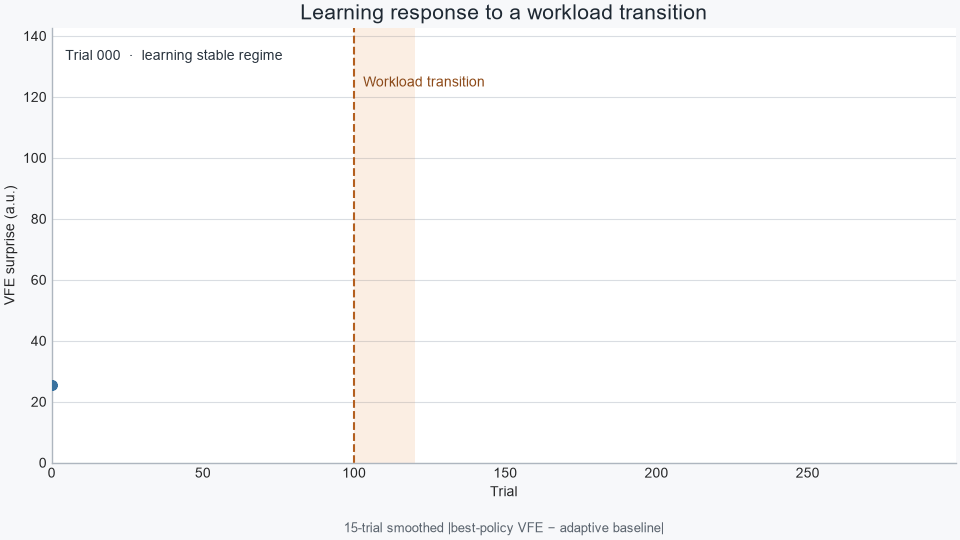

# PyAIF

PyAIF is a Python package for constructing discrete active-inference agents
with factorised hidden states. Version 0.1 provides categorical observations,
single-step inference, deep temporal inference, policy evaluation, action
selection, and categorical parameter learning.

## Citation

If you use PyAIF in your research, please cite:

D. A. Warnakulasuriya, J. Plosila and H. Haghbayan, “Towards
Self-Supervised Intent Recognition in Human-Robot Collaboration using Active
Inference,” *2026 11th International Conference on Control and Robotics
Engineering (ICCRE)*, Kyoto, Japan, 2026, pp. 191–198,
[doi:10.1109/ICCRE69951.2026.11593576](https://doi.org/10.1109/ICCRE69951.2026.11593576).

## Demonstration

[](https://youtu.be/4YzYsFVc6bE)

*Active Inference POMDP implementation on a Franka Emika Panda Robot — ASL Lab UTU.*

## Learning under uncertainty



The agent minimizes variational free energy (VFE) as it improves its
generative model. When the task context changes, prediction errors produce a
temporary spike in VFE surprise. Continued learning then refines the model for
the new context, reducing surprise again. The animation plots VFE surprise
(the smoothed deviation from an adaptive VFE baseline), rather than raw
cumulative model evidence.

Continuous-observation likelihoods are intentionally reserved for version 0.2.
Research applications and domain-specific likelihood construction belong in
the `examples/` directory or in separate repositories.

## Installation

PyAIF requires Python 3.9 or newer.

Install the published distribution:

```bash
python -m pip install pyaif-toolkit
```

The distribution is named `pyaif-toolkit` on PyPI, while the Python import
package remains `PyAIF`.

To install from a source checkout:

```bash
python -m pip install .
```

For development:

```bash
python -m pip install -e ".[dev]"
pytest
```

## Quick start

The public API separates the state-transition model, observation model, and
inference algorithm.

```python
import numpy as np

from PyAIF import (
    ActiveInfAgent,
    CategoricalLikelihood,
    GenerativeModel,
    ShallowInference,
)


def object_array(*values):
    result = np.empty(len(values), dtype=object)
    for index, value in enumerate(values):
        result[index] = np.asarray(value, dtype=float)
    return result


# A[o, s]: categorical observation likelihood.
A = object_array(
    np.array([
        [0.95, 0.05],
        [0.05, 0.95],
    ])
)

# B[s_next, s_previous, action]: controlled transitions.
B_factor = np.zeros((2, 2, 2))
B_factor[:, :, 0] = np.eye(2)
B_factor[:, :, 1] = np.fliplr(np.eye(2))
B = object_array(B_factor)

# D[s]: initial-state prior. C[o]: outcome preferences.
D = object_array(np.array([0.5, 0.5]))
C = object_array(np.zeros(2))

model = GenerativeModel(
    B=B,
    D=D,
    controls_dim=[2],
    controllable_factors=[0],
)
likelihood = CategoricalLikelihood(
    A=A,
    preferences=C,
    modality_dependencies=[[0]],
)
agent = ActiveInfAgent(
    model=model,
    likelihood=likelihood,
    inference=ShallowInference(),
    action_selection="deterministic",
)

agent.reset()
agent.observe([0])
agent.infer_states()
expected_free_energy, _ = agent.infer_policies()
action = agent.select_action()
```

Use `DeepTemporalInference(horizon=...)` for policy-dependent beliefs over
multiple time steps. Deep preferences have shape
`(number_of_outcomes, horizon)`.

## Performance and parallel policies

Deep temporal inference automatically batches independent policies into NumPy
tensor operations. This reduces Python-loop overhead while preserving
policy-by-policy inference results.

Policy evaluation can also use bounded worker threads:

```python
inference = DeepTemporalInference(
    horizon=3,
    message_passing_iterations=16,
    policy_workers=4,
)
```

`policy_workers=1` is the default and is usually fastest for small categorical
models because batched NumPy operations already process all policies
efficiently. Values greater than one split policy batches across threads
without copying the agent's arrays. Benchmark representative workloads before
increasing the worker count; threading is most useful when each policy
contains sufficiently large tensor contractions. `ShallowInference` accepts
the same `policy_workers` option for concurrent policy scoring.

See the reproducible
[PyAIF–pymdp CPU benchmark](benchmarks/results/2026-07-24-windows-cpu.md)
for comparisons with classic NumPy pymdp and current JAX pymdp.

## Agent lifecycle

The supported component-based lifecycle is:

```python
agent.reset(trial=trial)
agent.observe(observation, time_step=t)
agent.infer_states()
agent.infer_policies()
action = agent.select_action()
agent.learn()  # only when parameter learning is enabled
```

The older matrix-heavy constructor and methods such as `choose_action()` and
`perform_learning()` remain available while examples migrate, but new projects
should use the component constructor and lifecycle above.

## Model structure

- `GenerativeModel` owns state transitions (`B`), initial-state priors (`D`),
  control dimensions, controllable factors, and optional policies.
- `CategoricalLikelihood` owns observation likelihoods (`A`), preferences
  (`C`), and modality-to-factor dependencies.
- `ShallowInference` performs single-step factorised inference.
- `DeepTemporalInference` performs marginal message passing over a horizon.
- `PyAIF.learning` contains reusable categorical updates for `A`, `B`, `C`,
  `D`, and `E`.

See [Model shapes](docs/model-shapes.md) and
[Public API](docs/public-api.md) for details.

## Examples

- `examples/quickstart_discrete.py`: minimal categorical agent.
- `examples/learning_under_uncertainty/`: deep temporal parameter-learning
  experiments under epistemic and aleatoric uncertainty.

Model-selection and bounded-rationality experiments are maintained separately
from the reusable PyAIF package.

The automated regression suite covers the reusable component API and executes
one trial of each parameter-learning experiment.

Run the minimal component example with:

```bash
python examples/quickstart_discrete.py
```

## Version policy

- `0.1.x`: categorical observations and discrete parameter learning.
- `0.2.x`: planned continuous-observation likelihood components.

Behavioral changes are protected with numerical regression tests. Research
experiments may evolve independently from the packaged API.

## License

PyAIF is distributed under the
[BSD 3-Clause License](LICENSE). Copyright © 2026
Diluna A. Warnakulasuriya.

This software license does not automatically apply to papers, datasets,
figures, trained models, or other research artifacts.

## Development

```bash
ruff check PyAIF tests
ruff format --check PyAIF tests
pytest
python -m build
python -m twine check dist/*
```

See [CONTRIBUTING.md](CONTRIBUTING.md) for the pull-request and release
process.
