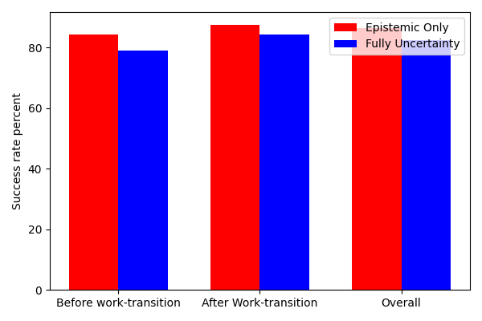

# Overview

This folder contains simulation code for an active inference agent performing a human robot collaboration handover task. The task involves a human who alternately requests one of two objects represented by red and blue cubes placed at two locations. The human signals a request by raising a hand and can also provide optional voice commands. After each request the human performs a quality check that introduces a variable delay before the next request. Voice commands act as helpful cues but they do not always imply an immediate handover, which creates temporal and observational uncertainty that the robot must handle.

# Task Model

The task is formulated as a partially observable Markov decision process with a hybrid structure. Human intention dynamics depend on robot actions which follow the POMDP formulation. Human trust evolves independently based on the interaction history which follows a hidden Markov model. The full model is represented as

P = (S, A, O, T, Π, O).

### State Space S

The latent state consists of two factors sI and sT.
Human intention sI represents one of request red, request blue or checking.
Human trust sT represents trust or no trust.

### Action Space A

The agent can execute handover red, handover blue or wait.

### Observation Space O

The agent receives multimodal observations consisting of
OL for human location,
OH for hand position resting or raised,
OV for voice commands red, blue, wait or silence.

### Transition Model T

The model is factorized into intention transitions and trust transitions. Intention transitions depend on robot actions. For example a correct handover moves the human to the checking state. Trust transitions follow a stochastic process governed by a variable θtrust in the interval zero to one that increases after correct autonomous actions and decreases after errors.

### Policy Space Π

The agent evaluates sequences of actions over a finite horizon to choose behavior that balances task success and uncertainty reduction.

### Observation Model O

Observations are conditionally independent across modalities. For example the probability of hearing the word red is highest when the intention state is request red.

# Simulation Files

### aleatoric_uncertainty.py

Simulates the active inference agent in an environment with persistent
epistemic and aleatoric uncertainty. The agent must operate under unknown
conditions that affect both sensing and outcomes.

### epistemic_uncertainty.py

Simulates the agent in an environment with persistent epistemic uncertainty
only. This serves as a baseline for studying the influence of aleatoric
uncertainty.

### main.py

Runs a single simulation for each setting, compares the results and plots success rates for evaluation.

# Output

Each simulation produces a dictionary of results including true states,
observations, trust values, selected actions, decisions, normalized model
parameters, policy scores, and a record of which parameter families were
updated. Results are saved as NumPy files for later analysis.
Success is measured as the proportion of task-consistent actions. Reference
runs from the original experiment produced approximately 86 percent success
for the epistemic-only model and 79 percent for the full-uncertainty model.
Exact rates vary because the environment and action selection are stochastic;
results should be aggregated across several seeds for scientific comparisons.

The default experiment runs 300 trials. Set `PYAIF_EXAMPLE_TRIALS` to run a
shorter smoke simulation and `PYAIF_EXAMPLE_OUTPUT_DIR` to select the result
directory. Set `PYAIF_EXAMPLE_SEED` when a reproducible stochastic run is
required.

# Figure

